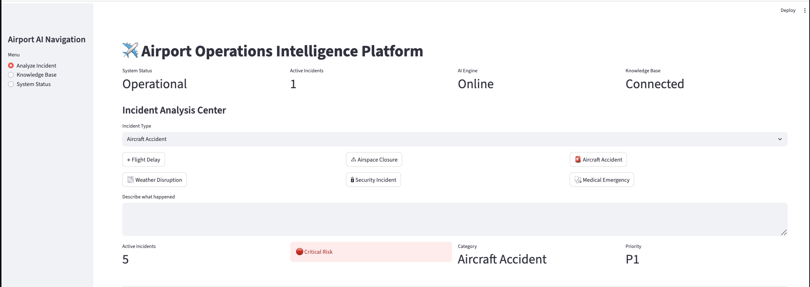
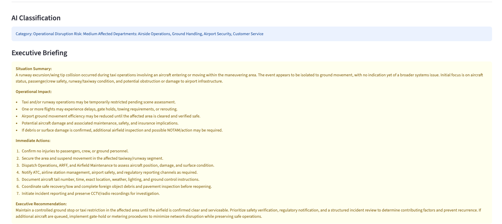
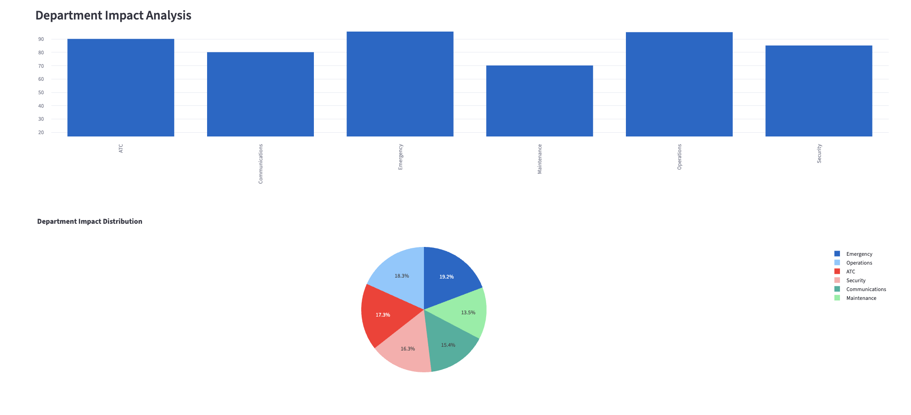
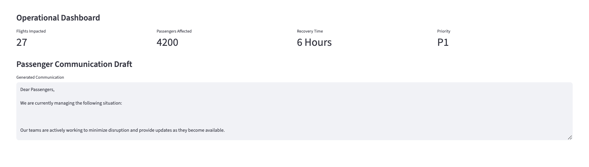

# ✈️ Airport Operations Intelligence Platform

An AI-powered operational intelligence platform designed to support airport incident management, risk assessment, executive decision-making, and operational coordination.

The platform combines Generative AI, operational analytics, and risk intelligence to help airport stakeholders rapidly assess incidents, understand operational impact, and generate actionable recommendations.

---

## 🚀 Key Features

### 🤖 AI Incident Analysis
- AI-powered incident classification
- Risk assessment and severity determination
- Operational impact evaluation
- Executive-level incident summaries

### 📊 Operational Intelligence Dashboard
- Real-time operational status monitoring
- Risk level visualization
- Priority assessment (P1–P4)
- Airport KPI tracking

### 🏢 Department Impact Analysis
- Operations impact assessment
- Emergency services impact analysis
- Security impact evaluation
- Air Traffic Control (ATC) impact monitoring
- Communications and maintenance impact tracking

### 📢 Automated Communications
- Passenger communication draft generation
- Executive briefing generation
- Recommended response actions
- Operational coordination support

---

## ✈️ Supported Airport Scenarios

- 🚨 Aircraft Accident
- 🔒 Security Incident
- ⚠️ Airspace Closure
- 🌫️ Weather Event
- 🩺 Medical Emergency
- ✈️ Flight Delay
- 🔥 Runway Closure
- 🧳 Baggage System Failure
- 💻 IT System Outage

---

## 🛠 Technology Stack

### AI & Intelligence
- OpenAI GPT Models
- Generative AI
- Operational Risk Assessment
- Decision Support Systems

### Development
- Python
- Streamlit
- Pandas
- Plotly
- Python Dotenv

### Visualization
- Interactive Dashboards
- Operational KPI Monitoring
- Department Impact Analytics
- Risk Distribution Analysis

---

## 📈 Platform Capabilities

- Incident Classification
- Risk Scoring
- Executive Briefings
- Passenger Communications
- Department Impact Analysis
- Operational Dashboards
- Decision Support Recommendations
- Operational Risk Monitoring

---

## 🔮 Future Enhancements

- Real-Time Airport Data Integration
- Flight Tracking APIs
- Predictive Risk Analytics
- Multi-Agent AI Workflows
- Retrieval-Augmented Generation (RAG)
- Airport Knowledge Base Integration
- Live Operations Monitoring
- Advanced Operational Intelligence

---

## 👩‍💻 Author

**Mouza AlDarmaki**

AI Engineer | Generative AI | Operational Intelligence | Risk Intelligence | Aviation AI

---

## 📷 Platform Preview

### Main Dashboard

### Executive Briefing & AI Classification

### Department Impact Analysis

### Operational Dashboard

